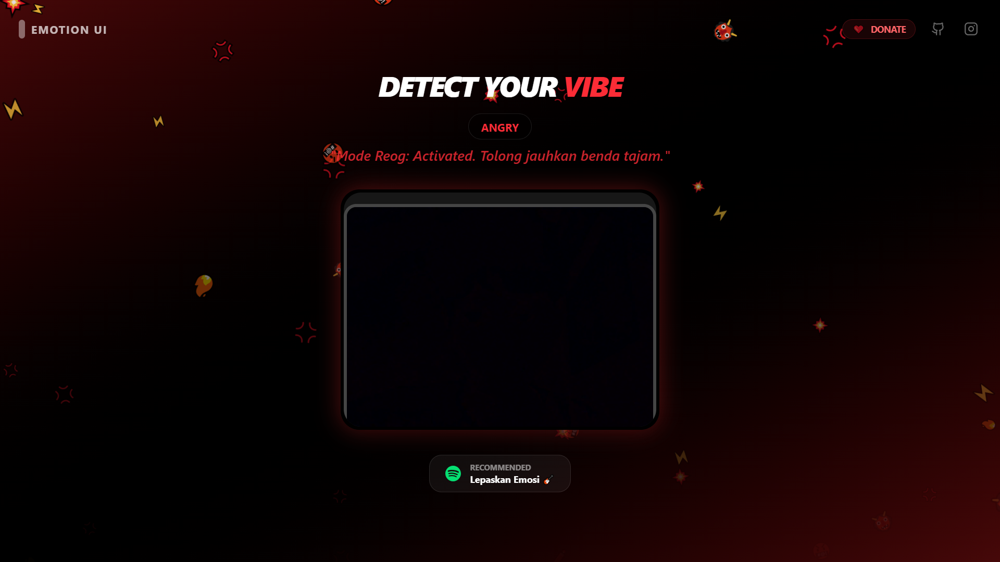

# Emotion UI - AI Vibe Detector

Emotion UI adalah aplikasi berbasis web yang memanfaatkan teknologi kecerdasan buatan (AI) untuk mendeteksi ekspresi wajah pengguna secara real-time. Proyek ini dirancang untuk menciptakan antarmuka yang dinamis dan interaktif, di mana elemen visual aplikasi bereaksi langsung terhadap emosi yang terdeteksi.

---

## Demo Tampilan


---

## Fitur Utama
* **Deteksi Emosi Real-time**: Menggunakan library face-api.js untuk mengidentifikasi ekspresi wajah seperti bahagia, sedih, marah, terkejut, dan netral.
* **Sistem Antarmuka Dinamis**: Skema warna, latar belakang gradient, dan efek partikel berubah secara otomatis sesuai dengan emosi pengguna.
* **Kutipan Kontekstual**: Menyediakan pesan teks atau kutipan yang disesuaikan dengan suasana hati yang terdeteksi.
* **Tema Kustom**: Pengguna dapat memilih berbagai paket tema visual seperti tema Anime, K-Pop, dan 8-Bit Pixel.
* **Tantangan Harian**: Fitur interaktif yang memberikan misi tertentu kepada pengguna untuk mendapatkan respon khusus dari sistem.
* **Rekomendasi Playlist**: Integrasi saran daftar putar musik yang disesuaikan dengan emosi saat ini.

---

## Teknologi yang Digunakan
* **Framework**: Next.js 15
* **Styling**: Tailwind CSS 4
* **AI Library**: face-api.js
* **Deployment**: Vercel

---

## Cara Menjalankan Secara Lokal

1.  **Clone repositori ini**:
    ```bash
    git clone [https://github.com/rezaaplvv/EmotionFace.git](https://github.com/rezaaplvv/EmotionFace.git)
    cd EmotionFace
    ```

2.  **Instal dependensi**:
    ```bash
    npm install
    ```

3.  **Jalankan server pengembangan**:
    ```bash
    npm run dev
    ```
    Buka http://localhost:3000 di browser Anda.

---

## Struktur Folder
* **/app**: Berisi logika utama halaman dan pengelolaan status emosi.
* **/components**: Berisi komponen fungsional seperti WebcamView.jsx.
* **/public/models**: Berisi file model AI yang diperlukan untuk proses deteksi wajah.

---

## Kontribusi
Proyek ini terbuka untuk kontribusi. Jika Anda menemukan bug atau ingin menambahkan fitur baru, silakan ajukan Pull Request atau buka Issue di repositori ini.

---

## Dukungan
Jika proyek ini bermanfaat bagi Anda, dukungan dapat diberikan melalui platform SociaBuzz pada profil rezaaplvv.

Dibuat oleh rezaaplvv
